# Procesverslag
Markdown is een simpele manier om HTML te schrijven.  
Markdown cheat cheet: [Hulp bij het schrijven van Markdown](https://github.com/adam-p/markdown-here/wiki/Markdown-Cheatsheet).

Nb. De standaardstructuur en de spartaanse opmaak van de README.md zijn helemaal prima. Het gaat om de inhoud van je procesverslag. Besteedt de tijd voor pracht en praal aan je website.

Nb. Door *open* toe te voegen aan een *details* element kun je deze standaard open zetten. Fijn om dat steeds voor de relevante stuk(ken) te doen.

https://kaj-benjaminsitanala.github.io/SushiMania/

## Jij

  
uitwerken voor kick-off werkgroep

  ### Auteur:
  Kaj-Benjamin Sitanala

  #### Je startniveau:
  Rood?
  #### Je focus:
  Responsiveness 

## Je website

  
uitwerken voor kick-off werkgroep

  ### Je opdracht:
  https://sushimania.co.uk/
  Een sushi website uit de UK, waarvan ik denk dat het wel moet lukken voor mij om dat na te maken...

  #### Screenshot(s) van de eerste pagina (small screen): 
  Homepage
  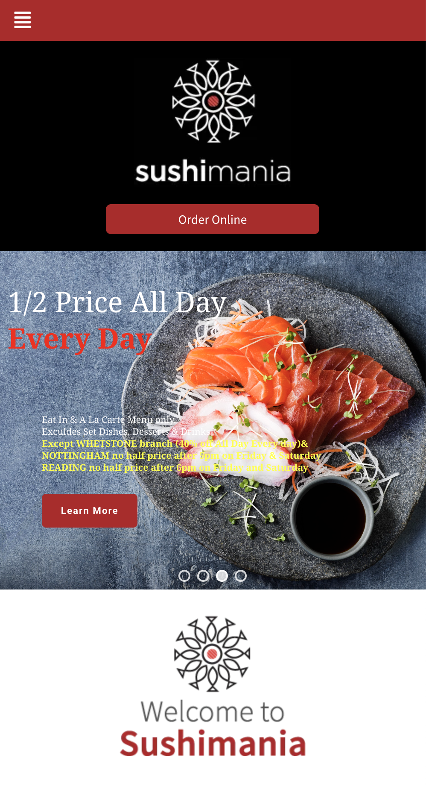
  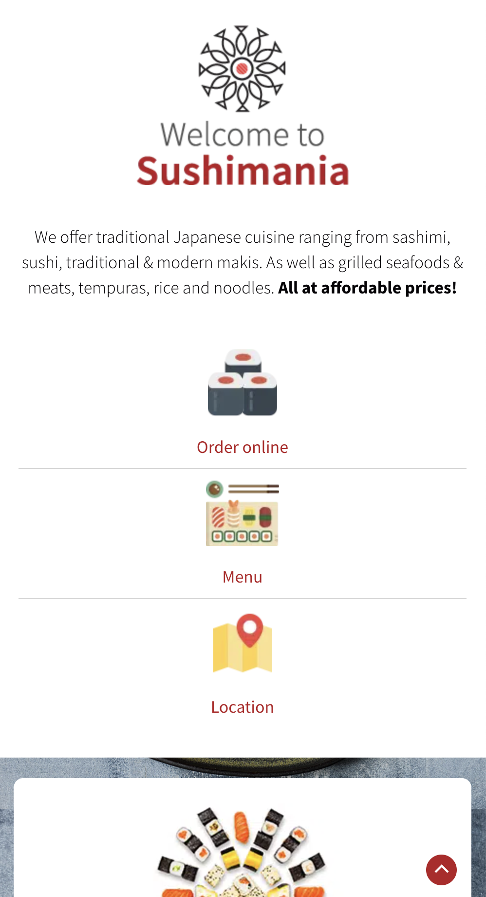
  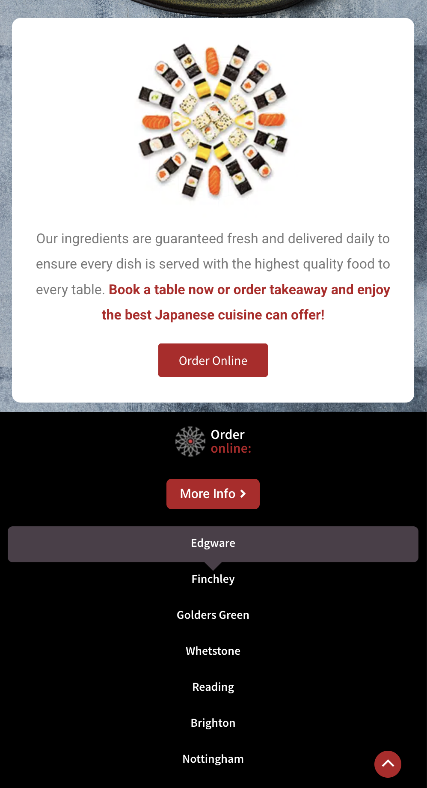
  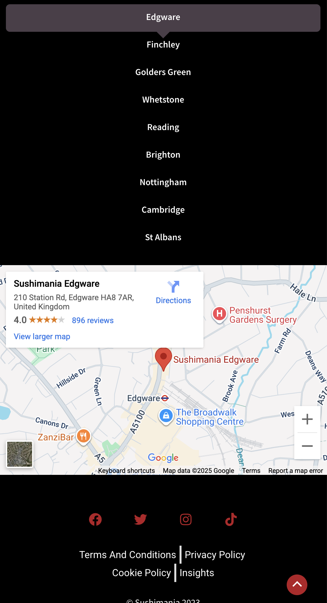

  #### Screenshot(s) van de tweede pagina (small screen):
  Menu
  Een pagina waarvan ik denk dat het moeilijk is, maar ook
  doormiddel van hulp wel moet lukken en tegelijkertijd handig kan zijn voor mijn buitenschoolse activiteiten (ik werk in horeca).
  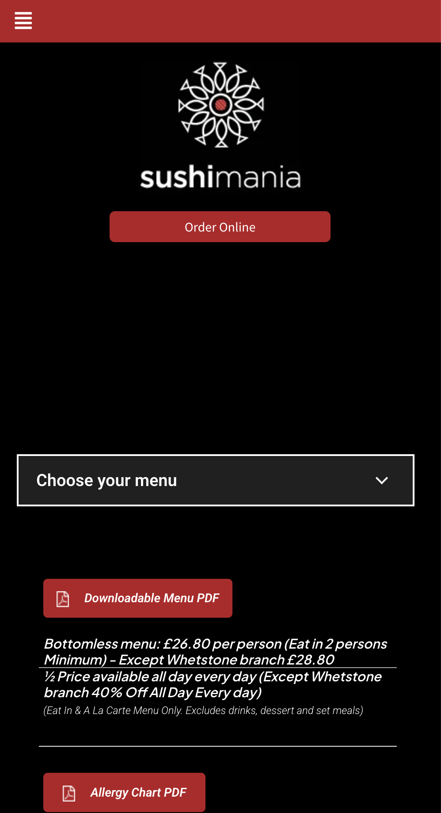
  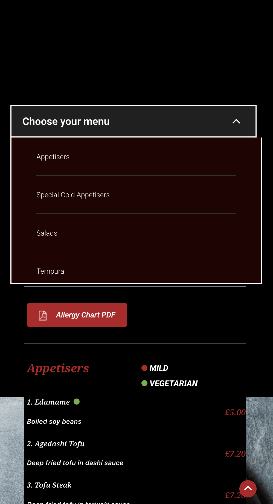
 

## Toegankelijkheidstest 1/2 (week 1)

  
uitwerken na test in 2e werkgroep

  ### Bevindingen
  Bevindingen ScreenReader:
  Op de eerste pagina van mijn website zijn meeste linkjes logisch, behalve de drie knoppen in de Welcome section van de pagina, hierbij zijn 3 knoppen met als knop een icon en een lapje text die de knop beschrijft, maar de icons zijn ook linkjes die als alt text alleen wat er weergegeven wordt aangeeft. Dus voor de screenreader is het hier handiger om per link de img en de p in 1 link te zetten met 1 omschrijving van de link.

  Voornamelijk op mijn 2e pagina (het menu) is het erg lastig navigeren door de vele optie's én omdat elke zin een heading is, dus als je door de headings heen gaat leest hij elke zin voor en elke prijs en elke beschrijving.

  Ook de besturing door het menu heen, met de verschillende opties is erg groot en een volledige lijst als navigatie.

  Ook de 'Mild' en de 'Vegetarian' is aangegeven met kleur (en omdat dat ook als heading is aangegeven) kan het erg verwarrend zijn. Ik ging er met de screenreader door (door de headings) en hij zegt bij elke pagina van het menu eerst mild en vegetarisch als aanwijzing dat rood mild betekent en groen vegetarisch. De kleuren worden niet aangegeven in de screenreader en bij elke optie die vegetarisch is wordt het ook niet aangegeven, dus hier zit ook nog verbetering in. Even gedouble checked bij studentassistent en inderdaad alle text is in headings tot en met heading 6.

  Bevindingen WCAG Checklist:
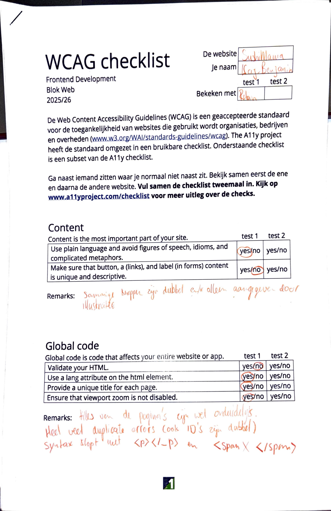
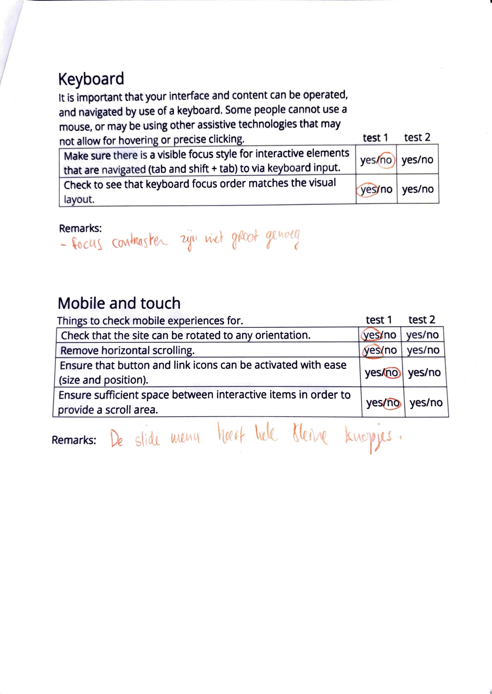
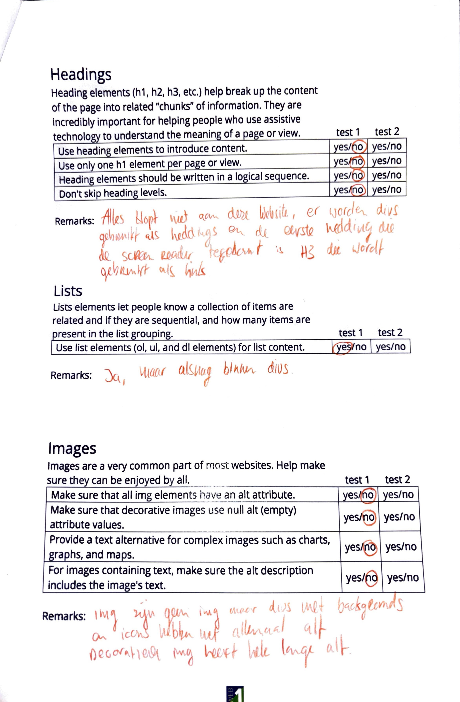
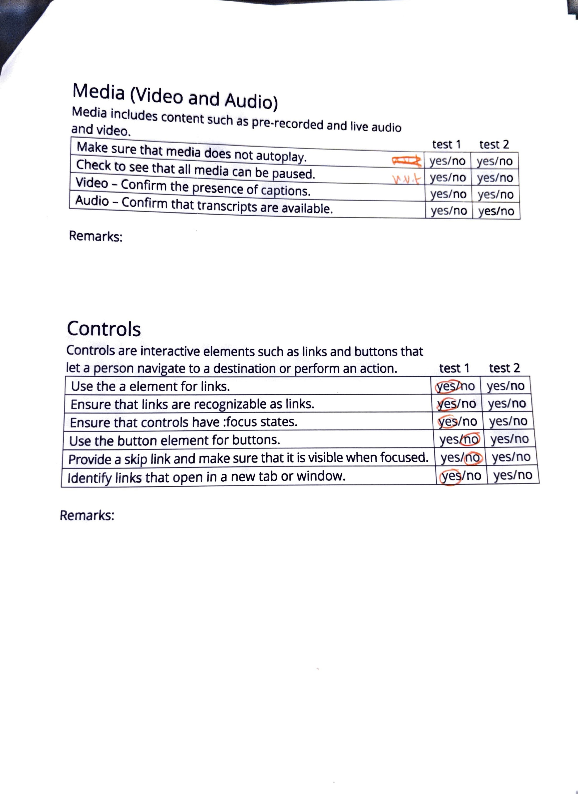
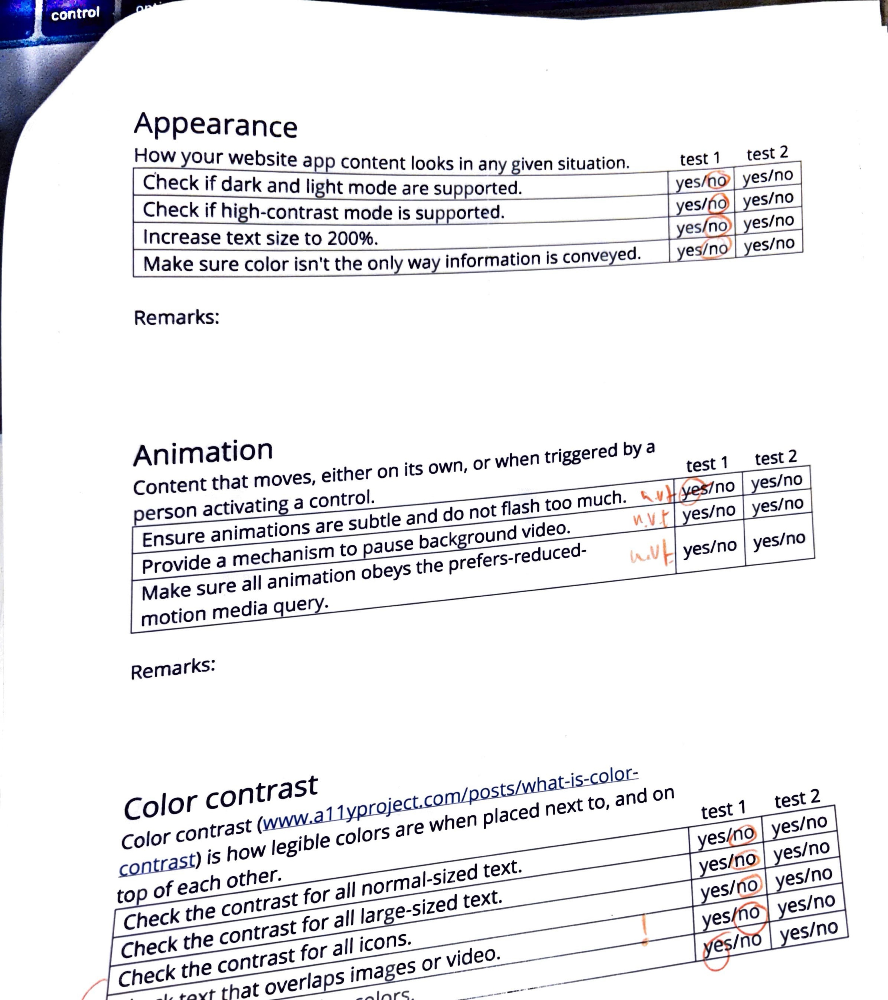

## Breakdownschets (week 1)

  
uitwerken na afloop 3e werkgroep

  ### de hele pagina: 
  
  

  ### dynamisch deel (bijv menu): 
  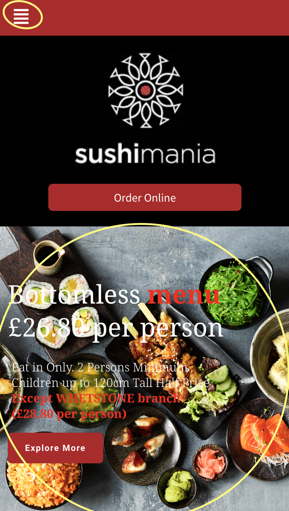
 

  ### wellicht nog een dynamisch deel (bijv filter): 
  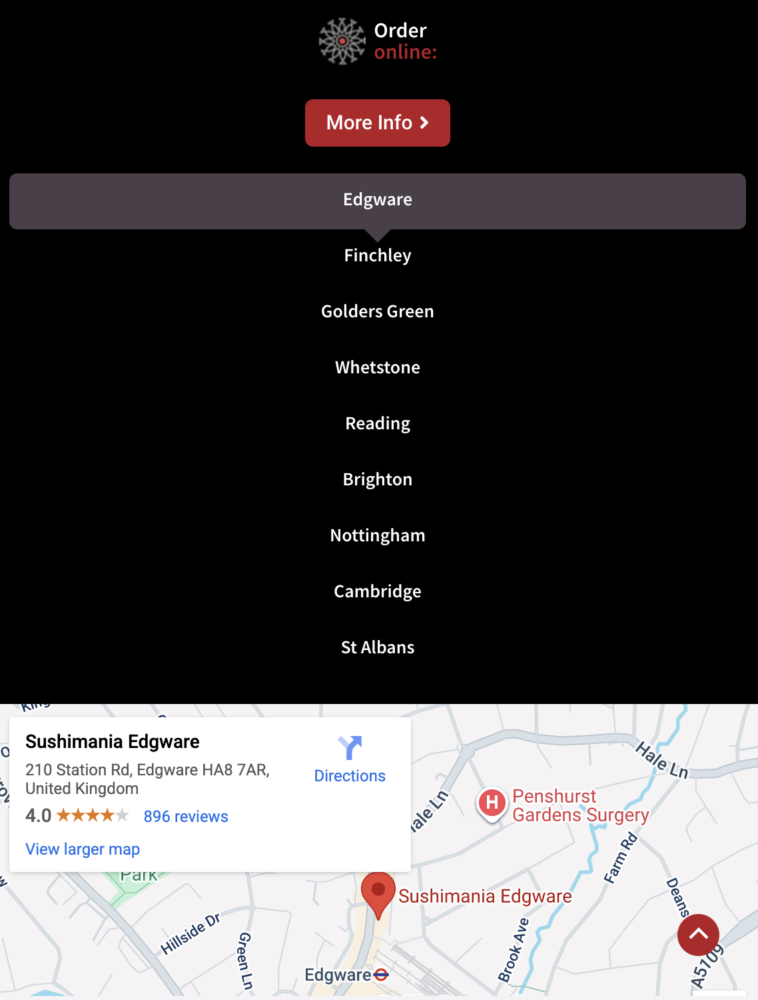

## Voortgang 1 (week 2)

  
uitwerken voor 1e voortgang

  ### Stand van zaken
  hier dit ging goed & dit was lastig (neem ook screenshots op van delen van je website en code)

  Het ging over het algemeen heel soepel met de homepage, ik heb de dingen die ik vorige keer (twee jaar terug alweer) mis deed flink vermeden: De dingen die ik vermeed zijn onder andere 'Display: Grid', positioneren vooral door margins te gebruiken, widths buiten het scherm door 'vw' te gebruiken (dit gaat nogsteeds soms, dus goed op letten).
  

 <video width="320" height="240" controls>
  <source src="./readme-images/ScreenRecording - Width bug.MP4" type="video/mp4">

Your browser does not support the video tag.
</video>

  Verder heb ik heel erg geprobeerd om mijn website snel af te maken, niet gehaast, maar er gewoon echt veel aan te zitten. Ik heb de eerste keer (de vorige keer) veel problemen gehad met tijdsnood en daardoor heb ik toen niks in deze readme gezet, allemaal opstapelende problemen. 

  Verder begrijp ik code in het algemeen beter dan vorige keer, wellicht door meer tijd (dit is mijn enige vak op het moment).

  ### Agenda voor meeting
  samen met je groepje opstellen

  | Lisa      
  Hoe ga ik de slider op de homepage aanpakken?
  Breakdownschets nagaan
  De divs / classes op sommige plekken, correct gebruikt of niet?
  Kijken of mijn Html semantisch correct is
  Css  opzet checken
  Ik wil minder gaan nesten en onnodige divs gbruiken, hoe pak ik dit aan

  | Kaa
  Breakdownschets nakijken
  Html structuur controleren of het matcht met breakdownschets
  Groenlicht krijgen voor css

  | Robin
  *
  Breakdownschets nakijken
  Html structuur controleren of het matcht met breakdownschets
  Groenlicht krijgen voor css

  | Kaj
  Minder nesten - inline style
  Verbeterpunten in schoonheid... Wat moet ik veranderen (ID's, classes, mediaqueries)
  Wat valt nog niet te snappen in mijn code...
  Breakdownschets nakijken en verbeteren.

  ### Verslag van meeting
  hier na afloop snel de uitkomsten van de meeting vastleggen

  - AutoSlide kan in CSS niet met javascript. Author toevoegen in head, FaviCon terugzetten.
  - SVG gebruiken voor social media iconen, vooral later makelijkker om die te veranderen van kleur.
  - Screenreader tips voor control-option-u als lijst om mijn website te checken. p boven img, informatie altijd boven decoratie.

## Voortgang 2 (week 3)

  
uitwerken voor 2e voortgang

  ### Stand van zaken
Ik ben veel bezig geweest met alles rechtzetten in mijn html en in mijn css, zoals mijn hoofdpagina die een section in een section met een artikel eronder met een section etc. had. Nu heb ik mijn hoofdpagin werkende gekregen, nogsteeds moet ik even kijken hoe het zit met headings voor mijn articles en sections, ik heb namelijk gelezen dat alle sections een heading moeten hebben. dus dan moet ik even kijken hoe ik mijn hierarchie, nadat ik de sections overhoop heb gehaalt, weer in orde kan zetten.

Verder heb ik een derde pagina toegevoegd, aangezien Sanne zei dat ik nog een extra iets moest toevoegen na mijn Menu pagina. Dus ik heb de contactpagina aangemaakt.

Ook alles is tot mijn weten responsive, behalve de menu pagina. Dus de hoodpagina is responsive en de contact pagina is responsive. Dus nu alleen nog de menu pagina, deze pagina heeft nog het filtermenu als challenge, die is op mobiele versie een dropdownmenu en als desktop versie wordt dit een sidemenu.

  ### Agenda voor meeting + verslag
  samen met je groepje opstellen

  | Kaj-Benjamin     
  - Kleinste responsive size 375px
  | Robin 
  - Ruimte tussen h1 en tekst is erg groot (gap van 0.5em op een serg grote font size was het probleem.)
  - Img vooraan, doormiddel van order: -1;
  | Lisa
  - Ul carousel css, li wordt niet doorzichtig, maar met img wel. Wordt uitgezocht door begeleiders.
  | Kaa
  - Aantal objectieve vragen over css.

## Toegankelijkheidstest 2/2 (week 4)

  
uitwerken na test in 9e werkgroep

  ### Bevindingen
  W3c validator laat bijna geen erros zien, alleen een paar articles en sections zonder heading offff een heading waar ik niks in heb gezet...

  Verder gaat alles vlekkeloos.

  Bevindingen test:
  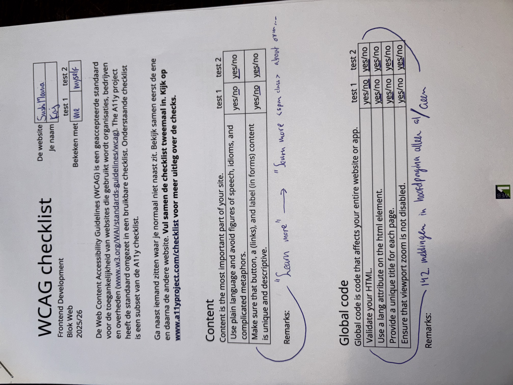
  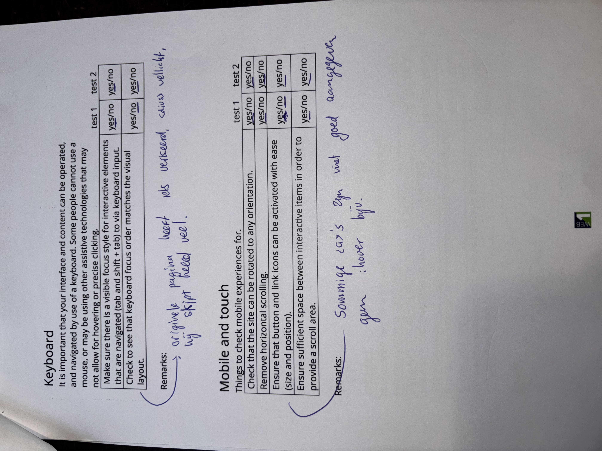
  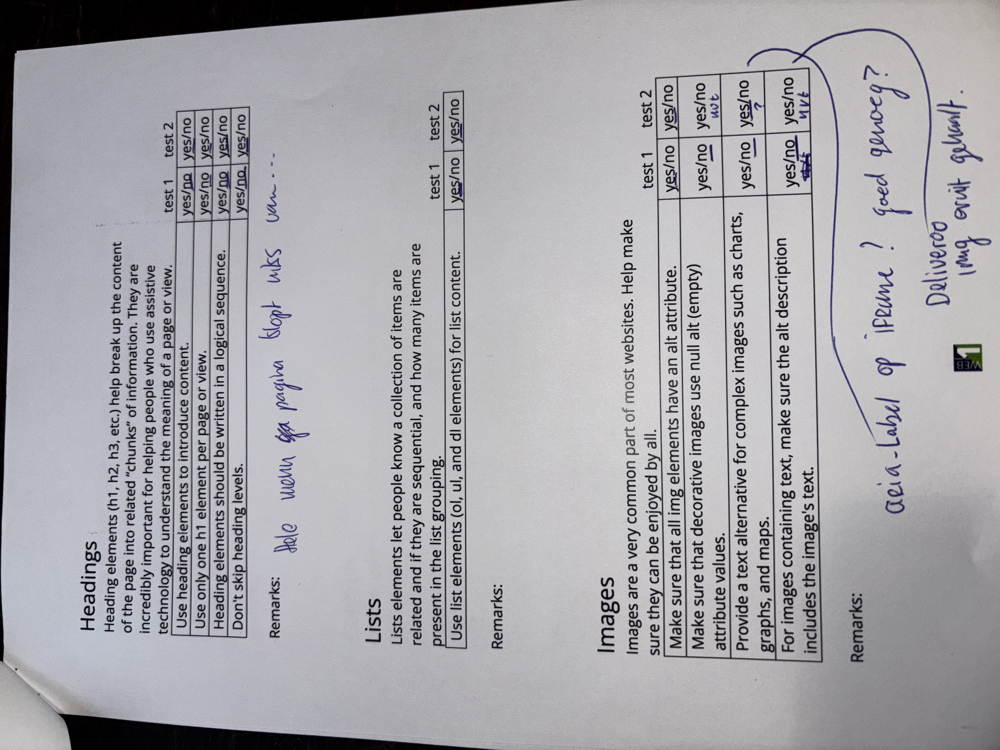
  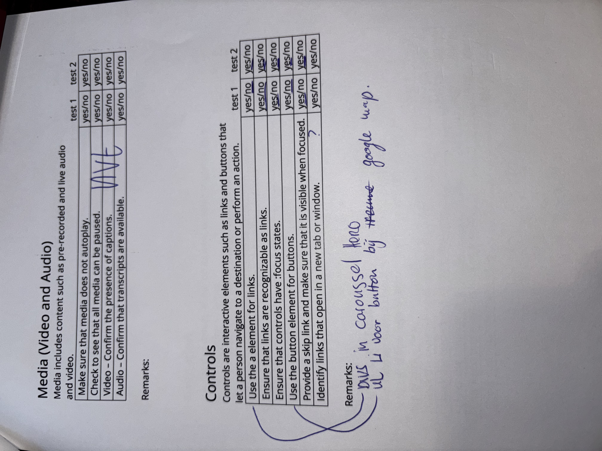
  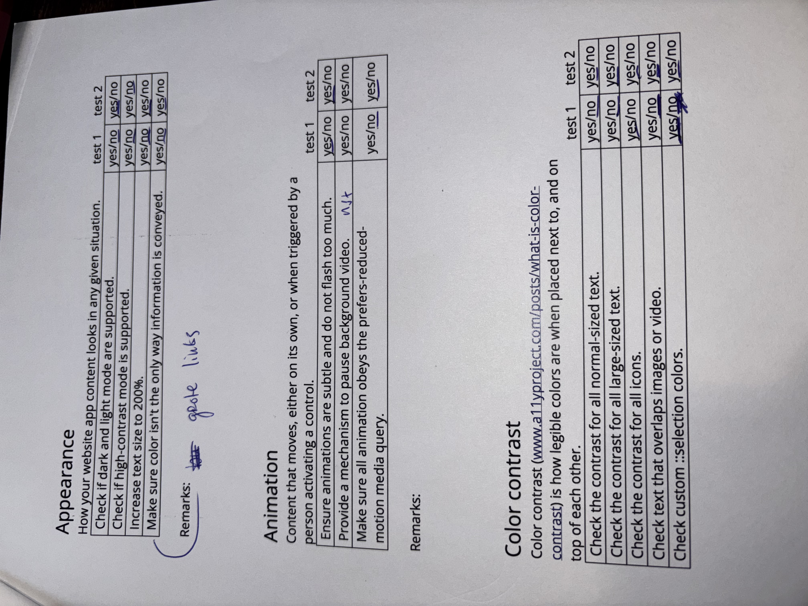

## Voortgang 3 (week 4)

  
uitwerken voor 3e voortgang

  ### Stand van zaken
  Ik ben er bijna zeker van dat mijn website klaar en functioneel is... behalve dat er waarschijnlijk een paar schoonheids foutjes in zitten... dus eigenlijk wil ik vragen gaan stellen over schoonheidsfoutjes.

  ### Verslag van meeting
  hier na afloop snel de uitkomsten van de meeting vastleggen

  - Hele mooie grid uitwerking met grid-template-area: hier dit, dan dat ...
  - select element met mooie uitleg en opties hiervoor
  - kleuren voor elke functionaliteit maken in mn :root
  - nog een punt
  - ...

### Notities voor eindgesprek

 Dingen die ik nog wilde noteren voor mijn eindgesprek 

W3C validator checks: De checks die ik net heb uitgevoerd zeggen dat alles nu prima eruitziet behalve pseudo elements als :checkmark worden als error aangegeven...
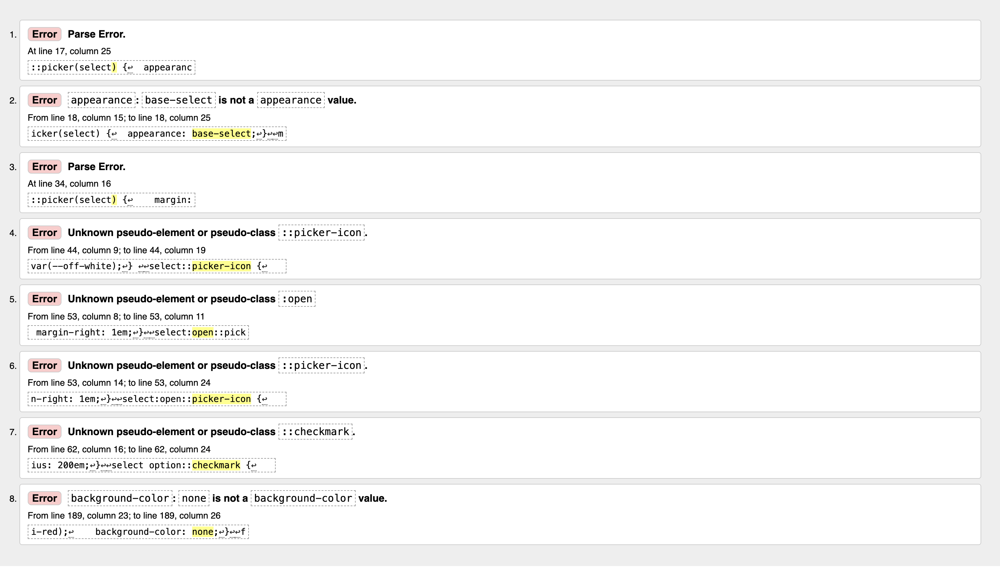
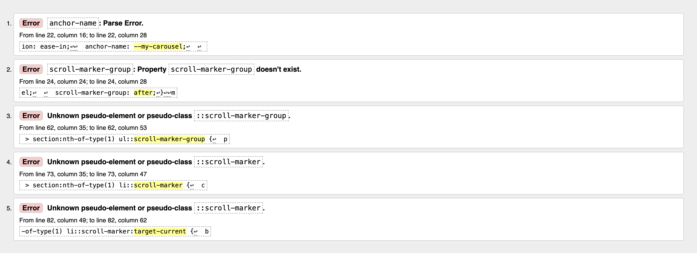

## Eindgesprek (week 5)

  
uitwerken voor eindgesprek

  ### Je uitkomst - karakteristiek screenshots:
  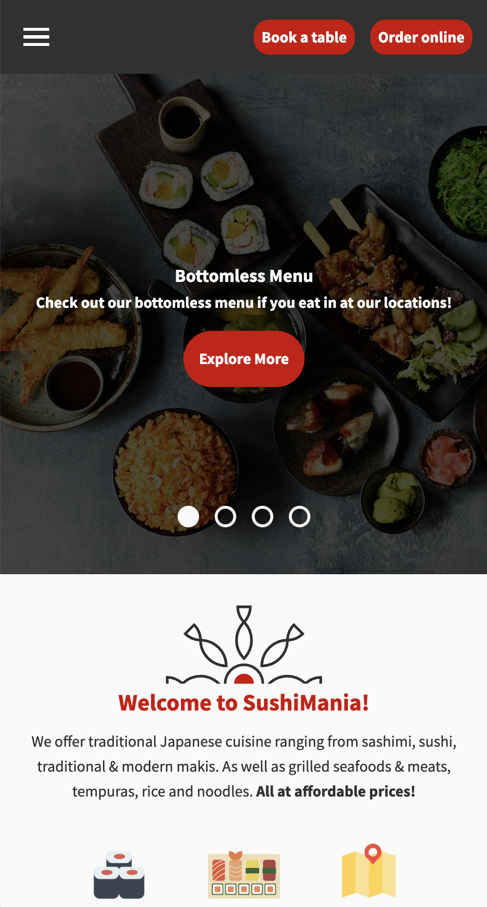
  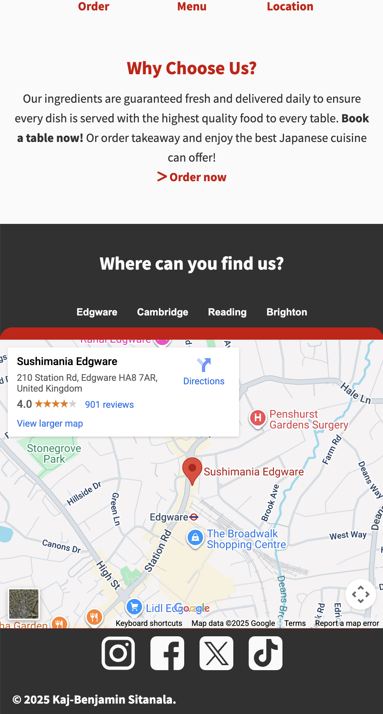
  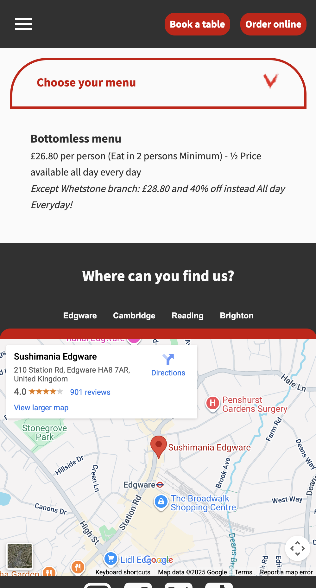
  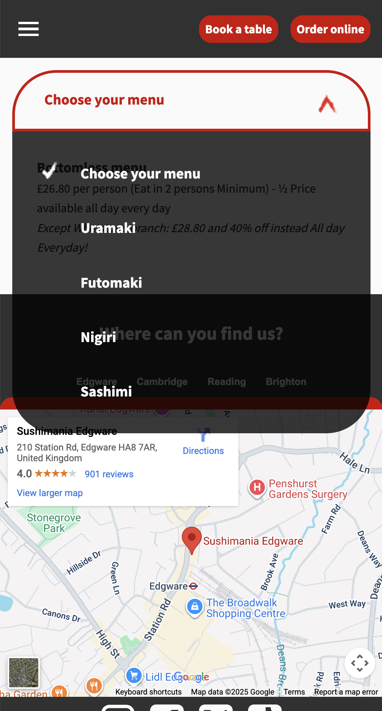
  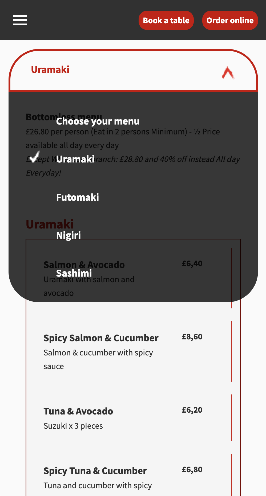
  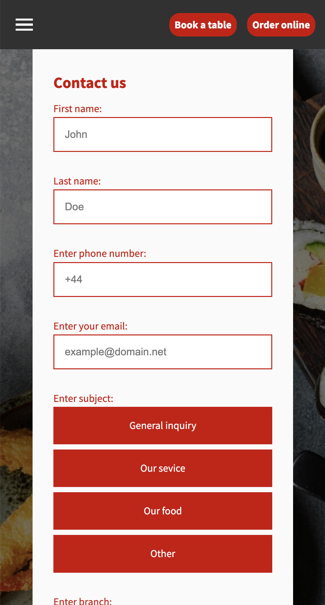
  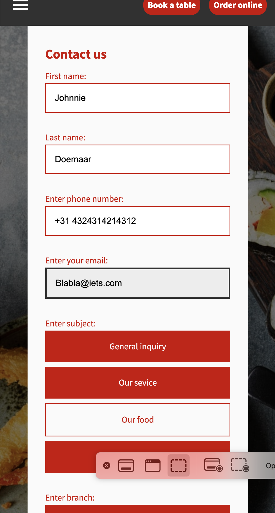

  ### Dit ging goed/Heb ik geleerd: 
  Ik denk wat er het best ging nu vergeleken met de laatste keer is dat ik veel minder op mijn eigen focus van visueel lette... De eerste keer dat ik dit vak deed lag mijn focus bij visueel de website gelijk maken, waarbij bij mij semantiek en syntax niet uitmaakte zolang de pagina er maar hetzelfde uitzag. Ook was mijn focus deze keer veeeeel beter en had ik er echt lol, dit is uit eindelijk doorgegaan naar dat ik buiten het vak om begonnen ben aan mijn eigen portfolio waarvoor ik nu de tweede versie aan het maken ben en daarnaast ook een website voor de studenten bar die ik run. Dus kortom wat beter ging is 'alles' in elke zin (motivatie, interesse daar ook bij getelt).

  Wat meer objectief beter ging is het stapsgewijs aan de slag gaan, dus vanuit de originele webpage te kijken welke elementen nodig zijn  en vanuit dat verder te werken en voor elk element aandachtig te kijken wat is er voor nodig en wellicht nog belangrijker wát niet.
  Ik heb bevonden dat het belangrijker is voor mijzelf om te kijken naar wat er bij hoort en wat ik weg kan laten, wat overzicht brengt.

  ### Dit was lastig/Is niet gelukt:
  Wat lastig is om het overzicht te houden, wat heb ik gemaakt en wat kan er uiteindelijk anders of juist weggehaalt worden.
  Een voorbeeld hiervan is denk ik mijn :root kleuren, die zouden eigenlijk veeeel specifieker moeten, maar wat mij nu tegenhoud is dat ik deze root kleuren overal al heb gebruikt en als ik nu de root aanpas moet ik alles aanpasssen, en dat houdt mij tegen... 

  Wat ook beter kon is bijvoorbeeld meerdere andere dingen in de :root te zetten zoals marges, breedtes etc... ik denk dat ik daardoor nog meer overzicht voor mijzelf kan maken...

  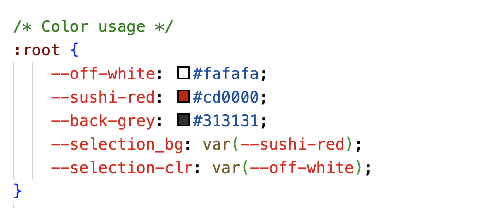

## Bronnenlijst

  
continu bijhouden terwijl je werkt

  Nb. Wees specifiek ('css-tricks' als bron is bijv. niet specifiek genoeg). 
  Nb. ChatGpT en andere AI horen er ook bij.
  Nb. Vermeld de bronnen ook in je code.

  1. ChatGPT - gebruikt om specifieke problemen in mijn CSS aan te kaarten om te kijken waar dingen fout gingen.
  bv: Een vraag aan ChatGPT = "I am making a website, i made a css carousel section, with a section and an ul inside. the ul is display: flex, flex direction row, and the overflow is put to scroll. my body has the property of overflow= hidden and the max width is 100%. why is it still possible to scroll the whole page horizontal into nothing? and With inspect I can see the flex overlay of the scrollable carousel outside of the boundaries." Bovendien kwam uit dit antwoord niks nuttigs en heb ik Sanne gevraagd voor hulp.
  2. https://developer.mozilla.org/en-US/docs/Web/CSS/CSS_overflow/CSS_carousels#responsive_carousel_final_result - gebruikt om informatie over mijn CSS carousel te vinden, zodat ik weet waar ik precies naar kijk in mijn carousel.
  3. (https://chrome.dev/carousel-configurator/) - Voor het daadwerkelijk maken van mijn Carousel.
  4. bron: Google (iframe google maps embedded)
  5. https://modx.com/blog/checking-and-unchecking-all-checkboxes-in-a-form
  6. https://www.w3schools.com/jsreF/prop_checkbox_checked.asp
  7. https://css-tricks.com/working-with-javascript-media-queries/

